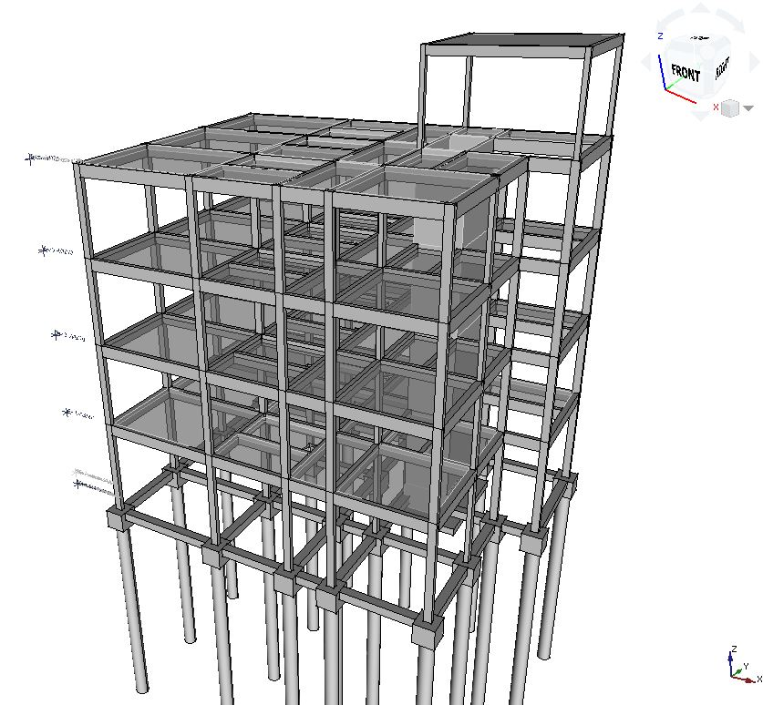
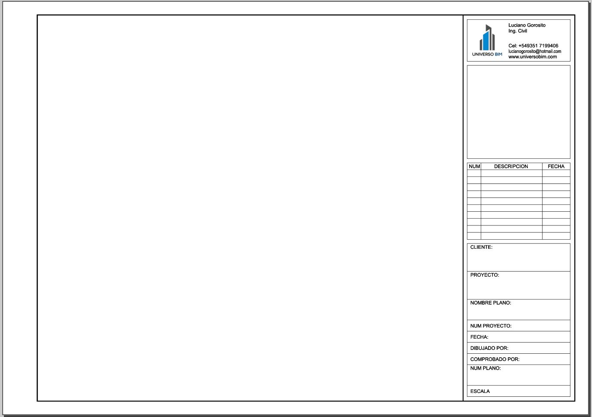

# FreeCad_Models

Modelos de ejemplo de FreeCAD

## 01 - Piloto Estructural

Modelo piloto de una estructura simple de hormigón armado.

## 02 - Librerías

Componentes necesarios para el proyecto.
